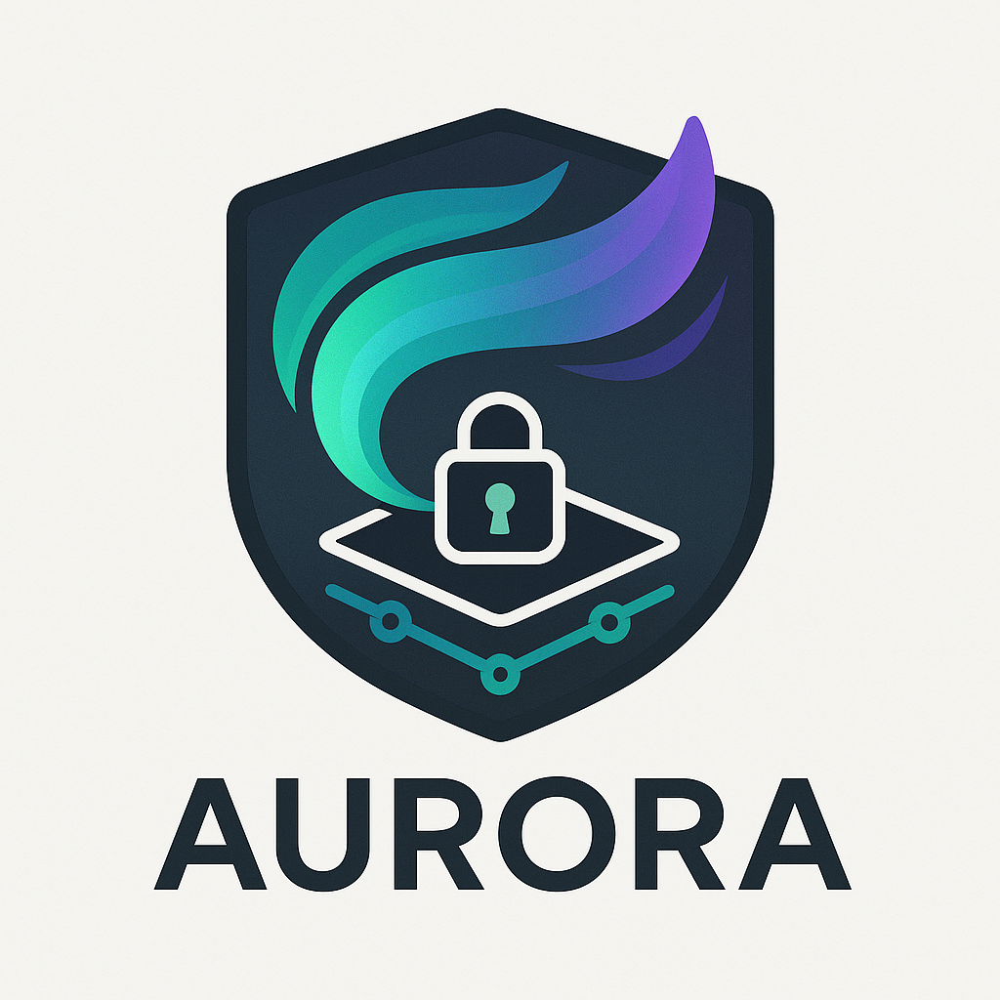
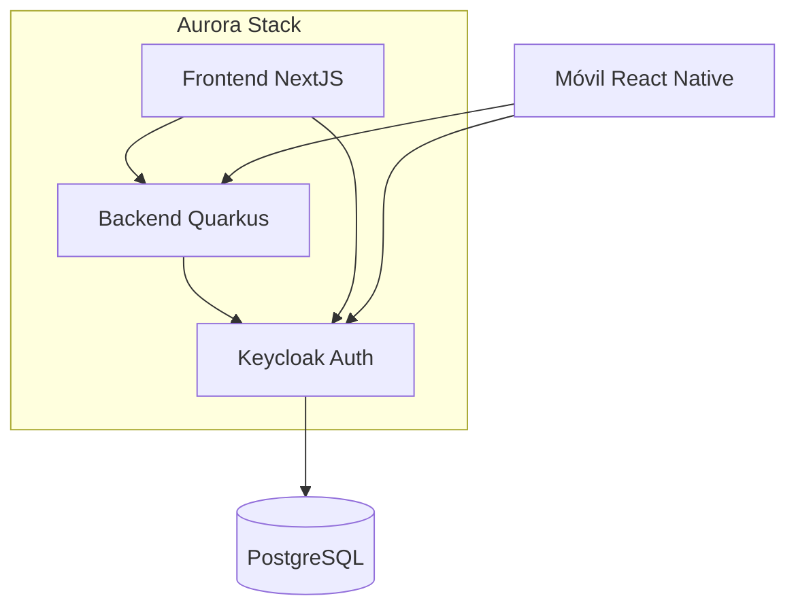
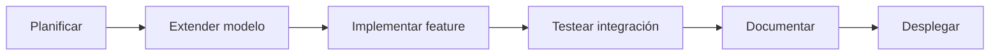

<p align="center">

</p>

# Aurora Stack: Plataforma Base para Soluciones Empresariales

**Tu punto de partida para desarrollar aplicaciones empresariales seguras y escalables con autenticación centralizada.**

## 🌟 ¿Qué es Aurora Stack?

Aurora Stack es un **template de proyecto preconfigurado** que proporciona una base sólida para desarrollar soluciones empresariales con:

- ✅ Autenticación y autorización con Keycloak  
- ✅ Backend API con Quarkus (Java)  
- ✅ Frontend administrativo con NextJS  
- ✅ Gestión centralizada de usuarios y permisos  
- ✅ Infraestructura como código (Docker)  

**Valor clave:** Reduce el tiempo de desarrollo inicial de 4 semanas a **menos de 1 semana** con arquitectura probada y documentación completa.

## 🚀 Casos de Uso Típicos

Ideal para construir:

- Portales de clientes/proveedores
- Herramientas internas de administración
- Aplicaciones SaaS multi-tenant
- Sistemas con roles complejos y jerarquías
- Soluciones que requieren SSO (Single Sign-On)

## 🧩 Componentes Principales



1. **Keycloak Configurado**
   - Plantillas personalizadas de login
   - Jerarquía de roles predefinida
   - Clientes OAuth para web/móvil

2. **Backend Quarkus**
   - API REST para gestión de usuarios
   - Integración con Keycloak Admin API
   - Modelo de datos empresariales extensible

3. **Frontend Administrativo**
   - CRUD de usuarios y aplicaciones
   - Asignación de permisos visual
   - Dashboard de monitoreo

4. **Infraestructura**
   - Docker Compose para desarrollo local
   - Helm Charts para Kubernetes
   - Scripts de despliegue en AWS/GCP

## 🏁 Empezando en 5 Pasos

1. **Clonar repositorio**:
   ```bash
   git clone https://github.com/tuorg/aurora-stack.git
   cd aurora-stack
   ```

2. **Iniciar servicios**:
   ```bash
   docker-compose up -d
   ```

3. **Configurar Keycloak**:
   - Acceder a: `http://localhost:8080`
   - Importar realm: `docs/keycloak/aurora-realm.json`

4. **Ejecutar Quarkus**:
   ```bash
   cd packages/quarkus-core
   ./mvnw quarkus:dev
   ```

5. **Lanzar frontend administrativo**:
   ```bash
   cd apps/admin-frontend
   npm install
   npm run dev
   ```

## 🔄 Ciclo de Desarrollo Recomendado



1. **Extensión del Modelo**:
   - Modificar entidades en `packages/quarkus-core/src/main/java/entities`
   - Actualizar diagrama ER en `docs/2-diseno/base-datos/modelo-er.md`

2. **Desarrollo de Features**:
   - Backend: Añadir endpoints en `*Resource.java`
   - Frontend: Crear componentes en `apps/admin-frontend/components`
   - Keycloak: Añadir roles en `docs/1-requerimientos/tecnicos/roles-permisos.md`

3. **Pruebas de Integración**:
   ```bash
   # Ejecutar suite completa
   ./scripts/test-all.sh
   ```

4. **Documentación**:
   - Actualizar `docs/3-implementacion/guias-desarrollo` para nuevas features
   - Añadir casos de uso en `docs/1-requerimientos/negocio`

5. **Despliegue**:
   - Desarrollo: `./scripts/deploy-dev.sh`
   - Producción: `./scripts/deploy-prod.sh`

## 📊 Comparativa: Aurora Stack vs Desarrollo Tradicional

| Capacidad               | Desarrollo Tradicional | Aurora Stack    |
|-------------------------|------------------------|-----------------|
| Configuración Keycloak  | 3-5 días               | 1 hora          |
| API Gestión de Usuarios | 2 semanas              | Pre-construida  |
| Login Personalizado     | 1 semana               | 2 horas         |
| Entorno Dockerizado     | 2 días                 | Pre-configurado |
| Seguridad OAuth2        | 1 semana               | Implementada    |

## 🌱 Cómo Crear Tu Solución Basada en Aurora

1. **Personalización inicial**:
   ```bash
   ./scripts/init-project.sh --name=mi-proyecto
   ```

2. **Modificaciones clave**:
   - Actualizar variables en `.env.template`
   - Personalizar temas en `packages/keycloak-themes`
   - Extender modelo de datos en Quarkus

3. **Despliegue en producción**:
   ```bash
   # Desplegar en Kubernetes
   helm install mi-proyecto charts/aurora-fullstack
   ```

## 📚 Recursos Adicionales

- [Documentación Completa](docs/README.md)
- [Arquitectura Técnica](docs/2-diseno/arquitectura.md)
- [Roadmap de Desarrollo](docs/3-implementacion/milestones/roadmap.md)
- [Guía de Contribución](CONTRIBUTING.md)

## 🛡️ Licencia

Aurora Stack es [MIT Licensed](LICENSE). Puedes usarlo libremente en proyectos comerciales y privados.

---

**¿Listo para acelerar tu desarrollo?**  
Clona el repositorio y comienza hoy mismo tu próxima solución empresarial con bases sólidas:

```bash
git clone https://github.com/tuorg/aurora-stack.git
```

[](https://demo-aurora-stack.com)