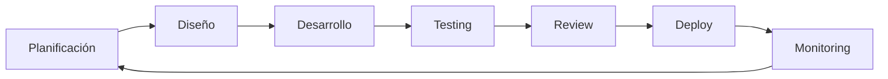

# 03 - Implementación

Esta sección documenta el **desarrollo y validación** del proyecto Aurora Stack, incluyendo milestones, guías de desarrollo y estrategias de testing.

## 📋 Contenido

### [0301 - Milestones](./0301-milestones/)
**Planificación y seguimiento del desarrollo**

Documenta el roadmap del proyecto:
- **MVP**: Producto mínimo viable y alcance inicial
- **Releases**: Planificación de versiones posteriores
- **Roadmap**: Funcionalidades futuras y evolución del producto
- **Métricas**: Indicadores de progreso y éxito

### [0302 - Guías de Desarrollo](./0302-guias-desarrollo/)
**Documentación técnica para desarrolladores**

Contiene guías específicas de implementación:
- **Integración Keycloak**: SPIs personalizados y configuraciones avanzadas
- **Quarkus Integration**: Configuración OIDC y microservicios
- **Estándares de Código**: Convenciones, linting y formatting
- **Arquitectura de Componentes**: Patrones y estructura del código

### [0303 - Pruebas](./0303-pruebas/)
**Estrategias de testing y validación**

Define la aproximación de calidad:
- **Test Cases**: Escenarios de prueba por funcionalidad
- **Testing Automatizado**: Unit, integration y end-to-end tests
- **Security Testing**: Pruebas de penetración y análisis de vulnerabilidades
- **Performance Testing**: Pruebas de carga y optimización

## 🎯 Filosofía de Implementación

### Principios de Desarrollo:
- **Test-Driven Development**: Tests antes que implementación
- **Continuous Integration**: Integración continua con validación automática
- **Code Review**: Revisión obligatoria antes de merge
- **Documentation First**: Documentar decisiones y APIs antes de implementar

### Flujo de Desarrollo:


## 🚀 Gestión de Releases

### Versionado Semántico:
- **MAJOR.MINOR.PATCH** (ej: 1.2.3)
- **MAJOR**: Cambios que rompen compatibilidad
- **MINOR**: Nuevas funcionalidades compatibles
- **PATCH**: Bug fixes y mejoras menores

### Estrategia de Branching:
```
main
├── develop
├── feature/[nombre-feature]
├── release/[version]
└── hotfix/[fix-urgente]
```

### Criterios de Release:
- **Funcionalidad**: Todas las features planificadas completadas
- **Calidad**: > 90% cobertura de tests, 0 bugs críticos
- **Documentación**: README, API docs y changelogs actualizados
- **Performance**: Benchmarks dentro de objetivos establecidos

## 🔧 Configuración de Desarrollo

### Entorno Local:
```bash
# Requisitos mínimos
docker >= 20.10
docker-compose >= 2.0
node >= 18.0 (si aplica)
java >= 17 (si aplica)

# Setup inicial
git clone [repo-url]
cd aurora-stack
cp .env.example .env
docker-compose up -d
```

### Scripts de Desarrollo:
```json
{
  "scripts": {
    "dev": "docker-compose up -d",
    "test": "npm run test:unit && npm run test:integration",
    "test:unit": "jest src/**/*.test.js",
    "test:integration": "jest tests/integration/**/*.test.js",
    "lint": "eslint src/ && prettier --check src/",
    "build": "npm run lint && npm run test && npm run build:prod"
  }
}
```

## 📊 Métricas de Calidad

### Code Quality:
- **Cobertura de Tests**: Mínimo 85%
- **Complejidad Ciclomática**: Máximo 10 por función
- **Duplicación de Código**: Máximo 3%
- **Vulnerabilidades**: 0 críticas, máximo 5 menores

### Performance:
- **Tiempo de Respuesta API**: < 200ms percentil 95
- **Tiempo de Carga UI**: < 3s first contentful paint
- **Throughput**: > 1000 requests/segundo
- **Memory Usage**: < 512MB por servicio

## 🛠️ Herramientas de Desarrollo

### Testing:
- **Unit Tests**: Jest, JUnit, pytest (según tecnología)
- **Integration Tests**: Testcontainers, docker-compose test
- **E2E Tests**: Cypress, Playwright, Selenium
- **API Testing**: Postman, REST Assured, Supertest

### Code Quality:
- **Linting**: ESLint, SonarQube, Checkstyle
- **Formatting**: Prettier, Black, google-java-format
- **Security**: Snyk, OWASP Dependency Check
- **Performance**: Artillery, JMeter, Lighthouse

### CI/CD:
- **Pipeline**: GitHub Actions, GitLab CI, Jenkins
- **Containerization**: Docker, Podman
- **Orchestration**: Kubernetes, Docker Swarm
- **Monitoring**: Prometheus, Grafana, ELK Stack

## 🔄 Proceso de Development

### Daily Workflow:
1. **Pull** últimos cambios de develop
2. **Crear** feature branch desde develop
3. **Implementar** funcionalidad con tests
4. **Validar** localmente (tests + lint)
5. **Push** y crear Pull Request
6. **Review** por al menos un compañero
7. **Merge** a develop tras aprobación

### Definition of Done:
- [ ] Funcionalidad implementada según especificación
- [ ] Tests unitarios y de integración pasando
- [ ] Cobertura de tests cumple mínimo establecido
- [ ] Código revisado y aprobado por peers
- [ ] Documentación actualizada (si aplica)
- [ ] Performance tests validados
- [ ] Security scan sin vulnerabilidades críticas
- [ ] Deploy a staging exitoso

## 📈 Monitoreo de Progreso

### Métricas de Equipo:
- **Velocity**: Story points completados por sprint
- **Lead Time**: Tiempo desde commit hasta producción
- **Deployment Frequency**: Frecuencia de deploys exitosos
- **Mean Time to Recovery**: Tiempo promedio de recuperación

### Reportes Automáticos:
- **Daily**: Build status + test results
- **Weekly**: Code quality metrics + security scan
- **Monthly**: Performance benchmarks + dependency updates
- **Release**: Changelog + deployment checklist