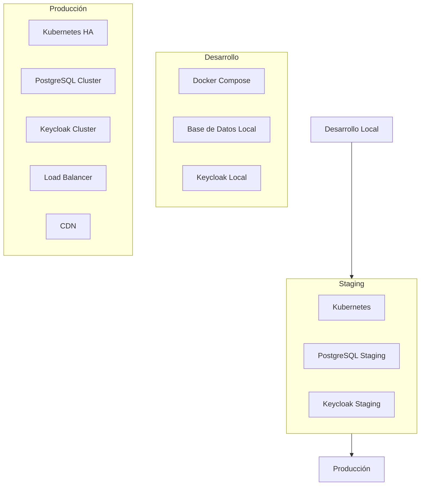

# 04 - Operación

Esta sección documenta los **procedimientos de despliegue y administración** del sistema Aurora Stack en diferentes entornos, incluyendo configuraciones de infraestructura y manuales operativos.

## 📋 Contenido

### [0401 - Despliegue](./0401-despliegue/)
**Configuraciones de infraestructura y despliegue**

Documenta la infraestructura y procedimientos de deploy:
- **Entornos**: Desarrollo, staging, producción
- **Docker & Kubernetes**: Configuraciones de contenedores y orquestación
- **CI/CD**: Pipelines de integración y despliegue continuo
- **Monitoreo**: Configuración de observabilidad y alertas

### [0402 - Manuales](./0402-manuales/)
**Guías operativas por rol**

Contiene manuales específicos para diferentes usuarios:
- **Administrador del Sistema**: Gestión de infraestructura y configuración
- **Usuario Final**: Guías de uso de las aplicaciones
- **Troubleshooting**: Diagnóstico y resolución de problemas comunes
- **Procedimientos de Emergencia**: Respuesta a incidentes críticos

## 🏗️ Arquitectura de Despliegue

### Entornos de Sistema:


### Configuración por Entorno:
| Característica | Desarrollo | Staging | Producción |
|----------------|------------|---------|------------|
| **Infraestructura** | Docker Compose | Kubernetes | Kubernetes HA |
| **Base de Datos** | PostgreSQL local | PostgreSQL staging | PostgreSQL cluster |
| **Autenticación** | Keycloak dev mode | Keycloak staging | Keycloak cluster |
| **SSL/TLS** | HTTP local | Let's Encrypt | Certificados comerciales |
| **Monitoreo** | Logs básicos | Métricas básicas | Observabilidad completa |
| **Backup** | No requerido | Diario | Continuo + archival |

## 🚀 Estrategia de Despliegue

### Pipeline de CI/CD:
```yaml
stages:
  - test
  - build
  - security-scan
  - deploy-staging
  - integration-tests
  - deploy-production
  - smoke-tests
```

### Estrategias de Deploy:
- **Blue-Green**: Para minimizar downtime
- **Rolling Updates**: Para actualizaciones graduales
- **Canary Releases**: Para validación con tráfico limitado
- **Feature Flags**: Para activación controlada de funcionalidades

### Rollback Procedures:
```bash
# Rollback automático en caso de falla
kubectl rollout undo deployment/aurora-backend
kubectl rollout undo deployment/aurora-frontend

# Verificación de estado
kubectl rollout status deployment/aurora-backend
kubectl get pods -l app=aurora-backend
```

## 📊 Monitoreo y Observabilidad

### Stack de Monitoreo:
- **Métricas**: Prometheus + Grafana
- **Logs**: ELK Stack (Elasticsearch, Logstash, Kibana)
- **Tracing**: Jaeger para distributed tracing
- **Alertas**: AlertManager + integración con Slack/PagerDuty

### Métricas Clave (SLIs):
```yaml
SLI_Definitions:
  availability:
    description: "Porcentaje de requests exitosos"
    target: "99.5%"
    measurement: "success_rate_5m"
  
  latency:
    description: "Tiempo de respuesta 95th percentile"
    target: "< 500ms"
    measurement: "response_time_p95"
  
  throughput:
    description: "Requests por segundo"
    target: "> 100 rps"
    measurement: "requests_per_second"
```

### Alertas Críticas:
```yaml
alerts:
  - name: "HighErrorRate"
    condition: "error_rate > 5%"
    duration: "5m"
    severity: "critical"
  
  - name: "HighLatency"
    condition: "latency_p95 > 1s"
    duration: "2m"
    severity: "warning"
  
  - name: "ServiceDown"
    condition: "up == 0"
    duration: "1m"
    severity: "critical"
```

## 🔒 Seguridad Operacional

### Hardening Checklist:
- [ ] Actualización regular de imágenes base
- [ ] Escaneo de vulnerabilidades en contenedores
- [ ] Configuración de network policies
- [ ] Secrets management con Vault/K8s secrets
- [ ] RBAC (Role-Based Access Control) configurado
- [ ] Audit logs habilitados
- [ ] Backups encriptados y verificados

### Gestión de Secretos:
```yaml
# Ejemplo de secret en Kubernetes
apiVersion: v1
kind: Secret
metadata:
  name: aurora-secrets
type: Opaque
data:
  database-password: <base64-encoded>
  keycloak-admin-password: <base64-encoded>
  jwt-secret: <base64-encoded>
```

## 📋 Procedimientos Operativos

### Checklist de Deploy:
- [ ] Validar tests en staging
- [ ] Verificar compatibilidad de base de datos
- [ ] Backup de producción completado
- [ ] Comunicar ventana de mantenimiento
- [ ] Deploy de aplicación
- [ ] Verificar health checks
- [ ] Ejecutar smoke tests
- [ ] Confirmar métricas estables

### Procedimientos de Emergencia:
```markdown
## Incidente: Aplicación No Responde

### 1. Diagnóstico Inmediato (< 5 min)
- Verificar status de pods: `kubectl get pods`
- Revisar logs recientes: `kubectl logs -f deployment/aurora-backend`
- Validar conectividad de base de datos

### 2. Mitigación (< 15 min)
- Reiniciar pods problemáticos
- Activar réplicas adicionales si es necesario
- Verificar resources (CPU/Memory)

### 3. Comunicación
- Notificar a stakeholders vía Slack
- Actualizar status page si está disponible
- Documentar en incident log

### 4. Resolución
- Identificar root cause
- Aplicar fix permanente
- Post-mortem en 24-48 horas
```

## 🔧 Herramientas Operativas

### Gestión de Infraestructura:
- **Kubernetes**: Orquestación de contenedores
- **Helm**: Gestión de aplicaciones Kubernetes
- **Terraform**: Infrastructure as Code
- **ArgoCD**: GitOps para deployments

### Monitoreo y Logs:
- **Prometheus**: Recolección de métricas
- **Grafana**: Visualización y dashboards
- **ELK Stack**: Centralización y análisis de logs
- **Jaeger**: Distributed tracing

### Gestión de Configuración:
- **ConfigMaps**: Configuración de aplicaciones
- **Secrets**: Gestión segura de credenciales
- **Vault**: Gestión avanzada de secretos
- **External Secrets**: Sincronización automática

## 📈 Métricas Operativas

### SLOs (Service Level Objectives):
| Servicio | Disponibilidad | Latencia (P95) | Error Rate |
|----------|----------------|----------------|------------|
| **API Backend** | 99.5% | < 500ms | < 1% |
| **Frontend** | 99.9% | < 2s | < 0.5% |
| **Keycloak** | 99.5% | < 300ms | < 1% |
| **Base de Datos** | 99.9% | < 100ms | < 0.1% |

### Capacidad y Escalamiento:
```yaml
auto_scaling:
  backend:
    min_replicas: 3
    max_replicas: 20
    target_cpu: 70%
    target_memory: 80%
  
  frontend:
    min_replicas: 2
    max_replicas: 10
    target_cpu: 60%
```

## 🔄 Mantenimiento Preventivo

### Tareas Regulares:
- **Diario**: Revisión de logs y métricas
- **Semanal**: Actualización de dependencies no críticas
- **Mensual**: Análisis de capacidad y performance
- **Trimestral**: Revisión de configuraciones de seguridad
- **Semestral**: Disaster recovery testing