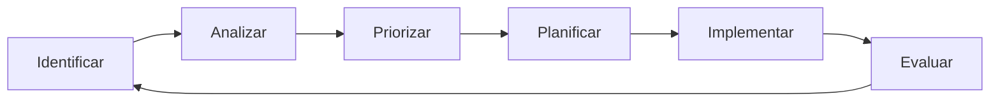

# 05 - Evolución

Esta sección documenta la **mejora continua** del proyecto Aurora Stack, capturando lecciones aprendidas, mejoras pendientes y recursos de referencia para la evolución del sistema.

## 📂 Documentos

### lecciones-aprendidas.md
**Retrospectivas y conocimiento acumulado**

Documenta el aprendizaje del equipo a lo largo del proyecto:
- **Retrospectivas de Sprint**: Qué funcionó bien, qué mejorar
- **Decisiones Técnicas**: Reflexiones sobre elecciones pasadas
- **Problemas Recurrentes**: Patrones de issues y sus soluciones
- **Best Practices**: Prácticas que han demostrado valor

### mejoras-pendientes.md
**Technical debt y backlog de mejoras**

Registra las mejoras identificadas pero no implementadas:
- **Technical Debt**: Código/configuración que necesita refactoring
- **Performance Optimizations**: Mejoras de rendimiento identificadas
- **Security Enhancements**: Fortalecimientos de seguridad pendientes
- **DX Improvements**: Mejoras en Developer Experience

### referencias.md
**Documentación y artículos de referencia**

Recopila recursos útiles para el equipo:
- **Documentación Oficial**: Links a docs de Keycloak, PostgreSQL, etc.
- **Artículos Técnicos**: Posts relevantes sobre arquitectura y patrones
- **Tutoriales**: Guías paso a paso para tecnologías del stack
- **Conferencias**: Videos y presentaciones relevantes

## 🔄 Proceso de Mejora Continua

### Ciclo de Retrospectivas:


### Formato de Retrospectiva:
```markdown
## Retrospectiva Sprint/Release [Número] - [Fecha]

### ✅ Qué funcionó bien
- Elemento positivo 1
- Elemento positivo 2

### ❌ Qué no funcionó
- Problema identificado 1
- Problema identificado 2

### 🔧 Qué podemos mejorar
- Mejora propuesta 1 (Owner: [Nombre], Deadline: [Fecha])
- Mejora propuesta 2 (Owner: [Nombre], Deadline: [Fecha])

### 📊 Métricas del Sprint
- Velocity: X story points
- Bugs encontrados: X
- Tiempo medio de resolución: X horas

### 💡 Experimentos para próximo sprint
- Experimentar con [técnica/herramienta]
- Probar [nuevo proceso/metodología]
```

## 📈 Gestión de Technical Debt

### Clasificación de Deuda Técnica:
| Tipo | Descripción | Prioridad | Impacto |
|------|-------------|-----------|---------|
| **Code Smell** | Código difícil de mantener | Media | Productividad |
| **Security** | Vulnerabilidades conocidas | Alta | Riesgo |
| **Performance** | Bottlenecks identificados | Media | UX |
| **Architecture** | Decisiones subóptimas | Baja | Escalabilidad |

### Formato de Registro:
```markdown
## TD-001: [Título de la Deuda]

### Descripción
Descripción clara del problema técnico.

### Contexto
- **Cuándo se introdujo**: Sprint/versión
- **Por qué se introdujo**: Razón (deadlines, conocimiento limitado, etc.)
- **Componentes afectados**: Lista de módulos/servicios

### Impacto Actual
- **Productividad**: Tiempo extra requerido para cambios
- **Mantenimiento**: Dificultad para debug/modificaciones
- **Performance**: Impacto en métricas del sistema
- **Escalabilidad**: Limitaciones de crecimiento

### Propuesta de Solución
- **Approach**: Estrategia de refactoring
- **Esfuerzo estimado**: Story points o horas
- **Riesgos**: Posibles complicaciones
- **Dependencias**: Otros elementos que deben cambiar

### Priorización
- **Urgencia**: Alta/Media/Baja
- **Impacto**: Alto/Medio/Bajo
- **Esfuerzo**: Alto/Medio/Bajo
- **Deadline sugerido**: Fecha objetivo
```

## 🎯 Roadmap de Evolución

### Categorías de Mejora:
```markdown
## 1. Funcionalidades del Producto
- [ ] Multi-tenancy avanzado
- [ ] Dashboard analytics
- [ ] API rate limiting
- [ ] Webhooks para eventos

## 2. Developer Experience
- [ ] Hot reload en desarrollo
- [ ] Better error messages
- [ ] CLI tools para admin
- [ ] SDK para integraciones

## 3. Operaciones
- [ ] Auto-scaling inteligente
- [ ] Backup automatizado cross-region
- [ ] Chaos engineering tests
- [ ] Observability mejorada

## 4. Seguridad
- [ ] Audit trail completo
- [ ] Pen testing automatizado
- [ ] Compliance reporting
- [ ] Zero-trust networking
```

### Criterios de Priorización:
1. **Business Value**: Impacto en objetivos de negocio
2. **User Impact**: Mejora en experiencia de usuario
3. **Technical Risk**: Mitigación de riesgos técnicos
4. **Effort**: Costo de implementación
5. **Dependencies**: Requisitos previos

## 📚 Gestión del Conocimiento

### Documentación de Lecciones:
```markdown
## Lección: [Título]

### Contexto
Situación que llevó al aprendizaje.

### Problema Enfrentado
Descripción del desafío o error.

### Solución Implementada
Cómo se resolvió el problema.

### Lección Aprendida
Qué se debe hacer diferente en el futuro.

### Aplicabilidad
Dónde más se puede aplicar este conocimiento.

### Tags
#keycloak #performance #security #database
```

### Base de Conocimiento:
- **Wiki Interna**: Documentación searchable del equipo
- **Decision Log**: Historial de decisiones importantes
- **Troubleshooting Guide**: Soluciones a problemas comunes
- **Onboarding Checklist**: Lista para nuevos miembros

## 🔍 Análisis de Tendencias

### Métricas de Evolución:
```yaml
evolution_metrics:
  code_quality:
    - technical_debt_ratio
    - cyclomatic_complexity
    - test_coverage
    - code_duplication
  
  team_productivity:
    - velocity_trend
    - lead_time
    - cycle_time
    - deployment_frequency
  
  system_health:
    - error_rate_trend
    - performance_regression
    - security_vulnerabilities
    - uptime_percentage
```

### Revisiones Trimestrales:
- **Architecture Review**: Evaluación de decisiones técnicas
- **Performance Analysis**: Tendencias de rendimiento
- **Security Assessment**: Estado de seguridad del sistema
- **Process Improvement**: Efectividad de metodologías

## 🌟 Innovación y Experimentación

### Proceso de Experimentación:
```markdown
## Experimento: [Nombre]

### Hipótesis
Lo que creemos que va a pasar.

### Métricas de Éxito
Cómo vamos a medir el resultado.

### Duración
Tiempo que durará el experimento.

### Criterios de Falla
Cuándo parar el experimento.

### Resultado
Qué pasó realmente.

### Decisión
Adoptar, adaptar o abandonar.
```

### Áreas de Innovación:
- **Nuevas Tecnologías**: Evaluación de herramientas emergentes
- **Metodologías**: Nuevas formas de trabajar
- **Arquitectura**: Patrones y approaches innovadores
- **Tooling**: Automatización y developer tools

## 🔄 Ciclo de Vida de Mejoras

### Proceso de Implementación:
1. **Identificación**: Durante retrospectivas o análisis
2. **Documentación**: Registro formal en mejoras-pendientes.md
3. **Priorización**: Evaluación con criterios establecidos
4. **Planificación**: Inclusión en backlog con estimación
5. **Implementación**: Desarrollo con tests y documentación
6. **Evaluación**: Medición de impacto post-implementación
7. **Documentación**: Actualización de lecciones aprendidas